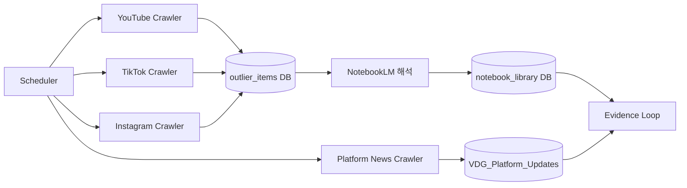

# Periodic Crawling Specification

**Version**: 1.1  
**Date**: 2026-01-07  
**Purpose**: 3플랫폼 아웃라이어 및 플랫폼 업데이트 주기적 수집 시스템 사양

---

## 1. Executive Summary

이 문서는 YouTube, TikTok, Instagram 3개 플랫폼에서 숏폼 아웃라이어 콘텐츠를 주기적으로 수집하고, 각 플랫폼의 주요 업데이트를 모니터링하기 위한 상세 기술 사양을 정의합니다.



---

## 2. Crawling Targets

### 2.1 Platform-Specific Outlier Sources

| Platform | Primary Source | API Method | Rate Limit | 
|----------|----------------|------------|------------|
| **YouTube** | YouTube Data API v3 | `search.list`, `videos.list` | 10,000 units/day |
| **TikTok** | TikTok Research API / Scraping | `video/query` | 1,000 req/day (Research) |
| **Instagram** | Instagram Graph API / Scraping | `ig_hashtag_search` | 30 req/hour |

### 2.2 Platform Update Sources

| Source | URL | Update Frequency | Content Type |
|--------|-----|------------------|--------------|
| YouTube Creator Blog | `https://blog.youtube/creator-and-artist-stories/` | Weekly | Algorithm, Monetization |
| TikTok Newsroom | `https://newsroom.tiktok.com/` | Weekly | Policy, Features |
| Instagram for Creators | `https://creators.instagram.com/blog` | Bi-weekly | Features, Tips |
| Social Media Today | `https://www.socialmediatoday.com/` | Daily | Industry Analysis |
| The Verge (Tech) | `https://www.theverge.com/tech` | Daily | Platform News |

---

## 3. Outlier Detection Criteria

### 3.1 Definition

> **Outlier** = 콘텐츠의 퍼포먼스가 크리에이터의 평균 대비 **50x 이상** 초과하는 경우

### 3.2 Platform-Specific Thresholds

| Metric | YouTube | TikTok | Instagram |
|--------|---------|--------|-----------|
| **Primary Metric** | Views | Views | Views + Saves |
| **Baseline** | Channel Avg Views | Creator Avg Views | Account Avg Engagement |
| **Outlier Multiplier** | ≥ 50x | ≥ 50x | ≥ 30x |
| **Min Absolute Views** | 100,000 | 500,000 | 50,000 |
| **Min Engagement Rate** | 5% | 8% | 10% |
| **Age Filter** | ≤ 30 days | ≤ 14 days | ≤ 7 days |

### 3.3 Scoring Formula

```python
def calculate_outlier_score(content, creator_baseline):
    """
    Outlier Score = (Content Views / Creator Avg Views) * Engagement Modifier
    """
    raw_multiplier = content.views / creator_baseline.avg_views
    engagement_modifier = 1 + (content.engagement_rate - 0.05)  # 5% baseline
    
    outlier_score = raw_multiplier * engagement_modifier
    
    return {
        "score": round(outlier_score, 1),
        "is_outlier": outlier_score >= 50,
        "tier": classify_tier(outlier_score)  # S/A/B/C
    }

def classify_tier(score):
    if score >= 500: return "S"  # Mega viral
    if score >= 200: return "A"  # Highly viral
    if score >= 100: return "B"  # Viral
    if score >= 50:  return "C"  # Outlier
    return None
```

---

## 4. Data Schema

> **정합성 주의**: `VDG_Outlier_Raw`는 운영/검토용 Sheet이며, **SoR는 DB**입니다.  
> 확장 필드는 `outlier_items.metadata` 또는 `notebook_library`에 저장하고, Sheet에는 요약만 동기화합니다.

### 4.1 VDG_Outlier_Raw (수집 데이터, 확장형)

| Column | Type | Description | Example |
|--------|------|-------------|---------|
| `outlier_id` | STRING | Unique ID | `yt_dQw4w9WgXcQ` |
| `platform` | ENUM | youtube/tiktok/instagram | `youtube` |
| `content_url` | STRING | 원본 콘텐츠 URL | `https://youtube.com/watch?v=...` |
| `creator_handle` | STRING | 크리에이터 아이디 | `@example_creator` |
| `creator_followers` | INT | 팔로워 수 | 125000 |
| `creator_avg_views` | INT | 평균 조회수 | 5000 |
| `content_views` | INT | 해당 콘텐츠 조회수 | 1500000 |
| `outlier_score` | FLOAT | 아웃라이어 점수 | 300.5 |
| `outlier_tier` | ENUM | S/A/B/C | `A` |
| `engagement_rate` | FLOAT | 인게이지먼트율 | 0.085 |
| `likes` | INT | 좋아요 수 | 125000 |
| `comments` | INT | 댓글 수 | 8500 |
| `shares` | INT | 공유 수 | 12000 |
| `saves` | INT | 저장 수 (IG only) | 5000 |
| `duration_seconds` | INT | 영상 길이 | 45 |
| `published_at` | DATETIME | 게시일 | 2025-12-20T14:30:00Z |
| `crawled_at` | DATETIME | 수집일 | 2025-12-24T06:00:00Z |
| `category` | STRING | 카테고리 | `Gaming` |
| `hashtags` | ARRAY | 해시태그 목록 | `["viral", "fyp"]` |
| `caption_preview` | STRING | 캡션 일부 (200자) | `This is how...` |
| `thumbnail_url` | STRING | 썸네일 URL | `https://...` |
| `audio_name` | STRING | 사용된 오디오 | `Original Sound` |
| `processing_status` | ENUM | pending/processed/failed | `pending` |

**운영용 최소 컬럼(현재 사용)**  
`source_name`, `source_url`, `collected_at`, `platform`, `category`, `title`, `views`, `growth_rate`, `author`, `posted_at`, `status`

### 4.2 VDG_Platform_Updates (플랫폼 업데이트)

| Column | Type | Description | Example |
|--------|------|-------------|---------|
| `update_id` | STRING | Unique ID | `yt_update_20251224_001` |
| `platform` | ENUM | youtube/tiktok/instagram/general | `youtube` |
| `source_url` | STRING | 원본 기사 URL | `https://blog.youtube/...` |
| `title` | STRING | 업데이트 제목 | `New Shorts Monetization` |
| `summary` | TEXT | AI 요약 (한국어) | `YouTube가 새로운...` |
| `category` | ENUM | algorithm/monetization/policy/feature | `monetization` |
| `impact_level` | ENUM | high/medium/low | `high` |
| `published_at` | DATETIME | 원본 게시일 | 2025-12-23T10:00:00Z |
| `crawled_at` | DATETIME | 수집일 | 2025-12-24T06:00:00Z |
| `keywords` | ARRAY | 주요 키워드 | `["shorts", "monetization"]` |
| `action_required` | BOOLEAN | 크리에이터 액션 필요 | true |
| `action_summary` | TEXT | 권장 액션 | `Shorts 수익화 신청 필요` |

---

### 4.3 Notebook Library (DB 래핑)
NotebookLM 해석 결과는 반드시 DB에 저장합니다.

| Column | Type | Description |
| --- | --- | --- |
| `id` | UUID | 노트북 엔트리 ID |
| `source_url` | TEXT | 원본 링크 |
| `summary` | JSONB | 훅/씬/오디오/템포 요약 |
| `cluster_id` | STRING | 유사 패턴 클러스터 |
| `created_at` | DATETIME | 생성 시각 |

## 5. Crawling Schedule

### 5.1 Frequency Matrix

| Job | Frequency | Time (KST) | Duration |
|-----|-----------|------------|----------|
| **YouTube Outliers** | Every 6 hours | 00:00, 06:00, 12:00, 18:00 | ~15 min |
| **TikTok Outliers** | Every 4 hours | 00:00, 04:00, 08:00, 12:00, 16:00, 20:00 | ~10 min |
| **Instagram Outliers** | Every 12 hours | 06:00, 18:00 | ~20 min |
| **Platform Updates** | Daily | 09:00 | ~5 min |
| **Evidence Loop Trigger** | Daily | 10:00 (after updates) | ~30 min |

### 5.2 Cron Expressions

```bash
# YouTube Outliers (6-hourly)
0 0,6,12,18 * * * python crawlers/youtube_outlier.py

# TikTok Outliers (4-hourly)
0 0,4,8,12,16,20 * * * python crawlers/tiktok_outlier.py

# Instagram Outliers (12-hourly)
0 6,18 * * * python crawlers/instagram_outlier.py

# Platform Updates (daily 9 AM KST)
0 9 * * * python crawlers/platform_updates.py

# Evidence Loop (daily 10 AM KST)
0 10 * * * python scripts/run_real_evidence_loop.py
```

---

## 6. API Implementation

### 6.1 YouTube Crawler

```python
"""
youtube_outlier.py - YouTube 아웃라이어 수집기
"""
import os
from datetime import datetime, timedelta
from googleapiclient.discovery import build
from google.oauth2.credentials import Credentials

class YouTubeOutlierCrawler:
    CATEGORIES = [
        "Gaming", "Entertainment", "Music", "Comedy",
        "Education", "Howto", "Science", "Sports"
    ]
    
    def __init__(self):
        self.youtube = build(
            'youtube', 'v3',
            developerKey=os.getenv('YOUTUBE_API_KEY')
        )
        self.quota_used = 0
        self.daily_quota = 10000
    
    def search_trending_shorts(self, category: str, max_results: int = 50):
        """트렌딩 Shorts 검색 (quota: 100 units)"""
        published_after = (datetime.utcnow() - timedelta(days=14)).isoformat() + 'Z'
        
        response = self.youtube.search().list(
            part='snippet',
            type='video',
            videoDuration='short',  # Shorts only
            order='viewCount',
            publishedAfter=published_after,
            videoCategoryId=self._get_category_id(category),
            maxResults=max_results
        ).execute()
        
        self.quota_used += 100
        return response.get('items', [])
    
    def get_video_stats(self, video_ids: list):
        """영상 통계 조회 (quota: 1 unit per ID)"""
        response = self.youtube.videos().list(
            part='statistics,contentDetails,snippet',
            id=','.join(video_ids)
        ).execute()
        
        self.quota_used += len(video_ids)
        return response.get('items', [])
    
    def get_channel_baseline(self, channel_id: str):
        """채널 평균 퍼포먼스 계산"""
        # 최근 20개 영상의 평균 조회수
        response = self.youtube.search().list(
            part='id',
            channelId=channel_id,
            type='video',
            order='date',
            maxResults=20
        ).execute()
        
        video_ids = [item['id']['videoId'] for item in response.get('items', [])]
        stats = self.get_video_stats(video_ids)
        
        views = [int(v['statistics'].get('viewCount', 0)) for v in stats]
        return sum(views) / len(views) if views else 0
    
    def calculate_outlier(self, video_stats: dict, baseline: float) -> dict:
        """아웃라이어 점수 계산"""
        views = int(video_stats['statistics'].get('viewCount', 0))
        likes = int(video_stats['statistics'].get('likeCount', 0))
        comments = int(video_stats['statistics'].get('commentCount', 0))
        
        engagement_rate = (likes + comments) / views if views > 0 else 0
        raw_multiplier = views / baseline if baseline > 0 else 0
        
        return {
            'outlier_score': round(raw_multiplier * (1 + engagement_rate), 1),
            'is_outlier': raw_multiplier >= 50 and views >= 100000,
            'engagement_rate': round(engagement_rate, 4)
        }
```

### 6.2 TikTok Crawler

```python
"""
tiktok_outlier.py - TikTok 아웃라이어 수집기
Note: TikTok Research API 또는 웹 스크래핑 사용
"""
import httpx
from typing import Optional

class TikTokOutlierCrawler:
    BASE_URL = "https://research-api.tiktok.com/v1"
    
    def __init__(self):
        self.client = httpx.Client(
            headers={
                "Authorization": f"Bearer {os.getenv('TIKTOK_RESEARCH_TOKEN')}"
            },
            timeout=30.0
        )
    
    def search_trending_videos(
        self,
        hashtags: list[str],
        min_views: int = 500000,
        days_back: int = 14
    ):
        """트렌딩 비디오 검색"""
        response = self.client.post(
            f"{self.BASE_URL}/video/query",
            json={
                "query": {
                    "and": [
                        {"field_name": "hashtag_name", "field_values": hashtags},
                        {"field_name": "view_count", "operation": "GTE", "field_values": [str(min_views)]}
                    ]
                },
                "start_date": self._days_ago(days_back),
                "end_date": self._today(),
                "max_count": 100
            }
        )
        return response.json().get('data', {}).get('videos', [])
    
    def get_creator_baseline(self, username: str) -> float:
        """크리에이터 평균 조회수"""
        response = self.client.get(
            f"{self.BASE_URL}/user/videos",
            params={"username": username, "count": 20}
        )
        videos = response.json().get('data', {}).get('videos', [])
        views = [v.get('view_count', 0) for v in videos]
        return sum(views) / len(views) if views else 0

    # Fallback: Web Scraping (if API unavailable)
    def scrape_trending_page(self):
        """웹 스크래핑 폴백"""
        from playwright.sync_api import sync_playwright
        
        with sync_playwright() as p:
            browser = p.chromium.launch(headless=True)
            page = browser.new_page()
            page.goto("https://www.tiktok.com/discover")
            # ... scraping logic
```

### 6.3 Instagram Crawler

```python
"""
instagram_outlier.py - Instagram 아웃라이어 수집기
"""

class InstagramOutlierCrawler:
    GRAPH_API_URL = "https://graph.facebook.com/v18.0"
    
    def __init__(self):
        self.access_token = os.getenv('INSTAGRAM_ACCESS_TOKEN')
        self.client = httpx.Client(timeout=30.0)
    
    def search_hashtag_media(self, hashtag: str, limit: int = 50):
        """해시태그 기반 Reels 검색"""
        # 1. Get hashtag ID
        hashtag_response = self.client.get(
            f"{self.GRAPH_API_URL}/ig_hashtag_search",
            params={
                "user_id": os.getenv('IG_BUSINESS_ACCOUNT_ID'),
                "q": hashtag,
                "access_token": self.access_token
            }
        )
        hashtag_id = hashtag_response.json()['data'][0]['id']
        
        # 2. Get top media for hashtag
        media_response = self.client.get(
            f"{self.GRAPH_API_URL}/{hashtag_id}/top_media",
            params={
                "user_id": os.getenv('IG_BUSINESS_ACCOUNT_ID'),
                "fields": "id,media_type,media_url,permalink,like_count,comments_count",
                "limit": limit,
                "access_token": self.access_token
            }
        )
        return media_response.json().get('data', [])
    
    def filter_reels_only(self, media_list: list) -> list:
        """Reels만 필터링"""
        return [m for m in media_list if m.get('media_type') == 'VIDEO']
```

### 6.4 Platform Updates Crawler

```python
"""
platform_updates.py - 플랫폼 업데이트 뉴스 수집기
"""
import feedparser
from bs4 import BeautifulSoup
from google import genai

class PlatformUpdatesCrawler:
    RSS_FEEDS = {
        "youtube": "https://blog.youtube/rss/",
        "tiktok": None,  # No RSS, use scraping
        "instagram": None,  # No RSS, use scraping
        "general": [
            "https://www.socialmediatoday.com/rss.xml",
            "https://www.theverge.com/rss/tech/index.xml"
        ]
    }
    
    SCRAPE_SOURCES = {
        "tiktok": "https://newsroom.tiktok.com/en-us/",
        "instagram": "https://creators.instagram.com/blog"
    }
    
    def __init__(self):
        self.genai_client = genai.Client(api_key=os.getenv('GOOGLE_API_KEY'))
    
    def fetch_youtube_updates(self) -> list[dict]:
        """YouTube 블로그 RSS 수집"""
        feed = feedparser.parse(self.RSS_FEEDS["youtube"])
        updates = []
        
        for entry in feed.entries[:10]:
            updates.append({
                "platform": "youtube",
                "source_url": entry.link,
                "title": entry.title,
                "published_at": entry.published,
                "raw_content": entry.summary
            })
        
        return updates
    
    def scrape_tiktok_newsroom(self) -> list[dict]:
        """TikTok Newsroom 스크래핑"""
        response = httpx.get(self.SCRAPE_SOURCES["tiktok"])
        soup = BeautifulSoup(response.text, 'html.parser')
        
        articles = soup.select('article.news-card')
        updates = []
        
        for article in articles[:10]:
            title = article.select_one('h3').text.strip()
            link = article.select_one('a')['href']
            date = article.select_one('time')['datetime']
            
            updates.append({
                "platform": "tiktok",
                "source_url": f"https://newsroom.tiktok.com{link}",
                "title": title,
                "published_at": date
            })
        
        return updates
    
    def summarize_with_ai(self, article: dict) -> dict:
        """Gemini로 기사 요약 및 영향도 분석"""
        prompt = f"""
        다음 소셜 미디어 플랫폼 업데이트 기사를 분석하세요.
        
        Title: {article['title']}
        Content: {article.get('raw_content', '')}
        
        응답 형식 (JSON):
        {{
            "summary_kr": "한국어 요약 (2-3문장)",
            "category": "algorithm|monetization|policy|feature",
            "impact_level": "high|medium|low",
            "action_required": true/false,
            "action_summary": "크리에이터가 취해야 할 액션 (있다면)"
        }}
        """
        
        response = self.genai_client.models.generate_content(
            model="gemini-2.0-flash-exp",
            contents=prompt
        )
        
        return json.loads(response.text)
```

---

## 7. Error Handling & Retry Logic

### 7.1 Retry Strategy

```python
from tenacity import retry, stop_after_attempt, wait_exponential, retry_if_exception_type
import httpx

RETRIABLE_ERRORS = (
    httpx.TimeoutException,
    httpx.ConnectError,
    httpx.HTTPStatusError,  # 5xx only
)

@retry(
    stop=stop_after_attempt(3),
    wait=wait_exponential(multiplier=1, min=2, max=30),
    retry=retry_if_exception_type(RETRIABLE_ERRORS)
)
def fetch_with_retry(client, url, **kwargs):
    response = client.get(url, **kwargs)
    if response.status_code >= 500:
        raise httpx.HTTPStatusError("Server Error", request=None, response=response)
    return response
```

### 7.2 Quota Management

```python
class QuotaManager:
    def __init__(self, daily_limit: int, redis_client):
        self.daily_limit = daily_limit
        self.redis = redis_client
        self.key_prefix = "quota:"
    
    def check_and_consume(self, platform: str, cost: int = 1) -> bool:
        """쿼타 확인 및 소비"""
        key = f"{self.key_prefix}{platform}:{self._today()}"
        current = int(self.redis.get(key) or 0)
        
        if current + cost > self.daily_limit:
            return False
        
        self.redis.incrby(key, cost)
        self.redis.expire(key, 86400)  # 24 hours TTL
        return True
    
    def get_remaining(self, platform: str) -> int:
        """남은 쿼타 조회"""
        key = f"{self.key_prefix}{platform}:{self._today()}"
        used = int(self.redis.get(key) or 0)
        return self.daily_limit - used
```

---

## 8. Monitoring & Alerting

### 8.1 Key Metrics

| Metric | Threshold | Alert Level |
|--------|-----------|-------------|
| Crawl Success Rate | < 95% | WARNING |
| Crawl Success Rate | < 80% | CRITICAL |
| API Quota Usage | > 80% | WARNING |
| API Quota Usage | > 95% | CRITICAL |
| New Outliers Found | = 0 (24h) | WARNING |
| Processing Lag | > 30 min | WARNING |

### 8.2 Health Check Endpoint

```python
@app.get("/health/crawlers")
async def crawler_health():
    return {
        "status": "healthy",
        "crawlers": {
            "youtube": await check_youtube_status(),
            "tiktok": await check_tiktok_status(),
            "instagram": await check_instagram_status(),
            "platform_updates": await check_updates_status()
        },
        "quotas": {
            "youtube": quota_manager.get_remaining("youtube"),
            "tiktok": quota_manager.get_remaining("tiktok"),
            "instagram": quota_manager.get_remaining("instagram")
        },
        "last_successful_crawl": await get_last_crawl_times()
    }
```

---

## 9. Storage & Deduplication

### 9.1 Google Sheets Integration

기존 `SheetManager` 확장:

```python
class OutlierSheetManager(SheetManager):
    SHEETS = {
        "VDG_Outlier_Raw": [...],  # Existing
        "VDG_Platform_Updates": [
            "update_id", "platform", "source_url", "title",
            "summary", "category", "impact_level", "published_at",
            "crawled_at", "keywords", "action_required", "action_summary"
        ]
    }
    
    def deduplicate_outlier(self, outlier_id: str) -> bool:
        """중복 체크 - 이미 존재하면 False 반환"""
        existing_ids = self._fetch_column("VDG_Outlier_Raw", "A")
        return outlier_id not in existing_ids
    
    def append_if_new(self, sheet_name: str, row: list) -> bool:
        """새로운 데이터만 추가"""
        unique_id = row[0]  # First column is always ID
        if self.deduplicate_outlier(unique_id):
            self.append_data(sheet_name, [row])
            return True
        return False
```

### 9.2 Future: Database Migration

Google Sheets 한계 도달 시 PostgreSQL/Supabase 마이그레이션:

```sql
-- Outliers table
CREATE TABLE outliers (
    outlier_id VARCHAR(100) PRIMARY KEY,
    platform VARCHAR(20) NOT NULL,
    content_url TEXT NOT NULL,
    creator_handle VARCHAR(100),
    outlier_score DECIMAL(10, 2),
    outlier_tier CHAR(1),
    views BIGINT,
    engagement_rate DECIMAL(5, 4),
    published_at TIMESTAMPTZ,
    crawled_at TIMESTAMPTZ DEFAULT NOW(),
    metadata JSONB,
    
    INDEX idx_outliers_platform_score (platform, outlier_score DESC),
    INDEX idx_outliers_published (published_at DESC)
);

-- Platform updates table
CREATE TABLE platform_updates (
    update_id VARCHAR(100) PRIMARY KEY,
    platform VARCHAR(20) NOT NULL,
    title TEXT NOT NULL,
    summary TEXT,
    category VARCHAR(50),
    impact_level VARCHAR(10),
    published_at TIMESTAMPTZ,
    crawled_at TIMESTAMPTZ DEFAULT NOW(),
    
    INDEX idx_updates_platform_date (platform, published_at DESC)
);
```

---

## 10. Environment Variables

```bash
# .env file additions
# YouTube
YOUTUBE_API_KEY=your_youtube_api_key

# TikTok (Research API or alternative)
TIKTOK_RESEARCH_TOKEN=your_tiktok_token

# Instagram
INSTAGRAM_ACCESS_TOKEN=your_instagram_token
IG_BUSINESS_ACCOUNT_ID=your_business_account_id

# Redis (for quota management)
REDIS_URL=redis://localhost:6379/0

# Monitoring
SLACK_WEBHOOK_URL=https://hooks.slack.com/services/...
ALERT_EMAIL=alerts@example.com

# Crawling thresholds
YOUTUBE_MIN_VIEWS=100000
TIKTOK_MIN_VIEWS=500000
INSTAGRAM_MIN_VIEWS=50000
OUTLIER_MULTIPLIER_THRESHOLD=50
```

---

## 11. Deployment

### 11.1 Docker Configuration

```dockerfile
# Dockerfile.crawler
FROM python:3.11-slim

WORKDIR /app
COPY requirements-crawler.txt .
RUN pip install -r requirements-crawler.txt

# Install Playwright for scraping fallback
RUN playwright install chromium

COPY crawlers/ ./crawlers/
COPY scripts/ ./scripts/

CMD ["python", "-m", "crawlers.scheduler"]
```

### 11.2 Kubernetes CronJob

```yaml
apiVersion: batch/v1
kind: CronJob
metadata:
  name: youtube-outlier-crawler
spec:
  schedule: "0 0,6,12,18 * * *"  # Every 6 hours
  jobTemplate:
    spec:
      template:
        spec:
          containers:
          - name: crawler
            image: komission-crawler:latest
            command: ["python", "crawlers/youtube_outlier.py"]
            envFrom:
            - secretRef:
                name: crawler-secrets
          restartPolicy: OnFailure
```

---

## 12. Next Steps

| Phase | Task | Timeline |
|-------|------|----------|
| **Phase 1** | YouTube Outlier Crawler 구현 | Week 1 |
| **Phase 2** | TikTok Crawler (Research API 신청) | Week 2 |
| **Phase 3** | Instagram Crawler + Platform Updates | Week 3 |
| **Phase 4** | Monitoring Dashboard | Week 4 |
| **Phase 5** | Visual Outlier UI (Virlo 벤치마크 기반) | Week 5-6 |

---

## Appendix: Virlo Feature Parity Checklist

Virlo 분석 결과 기반 구현 우선순위:

- [ ] **Outlier Score UI** - Card grid with 50x+ multiplier display
- [ ] **Platform Filter** - YouTube / TikTok / Instagram toggle
- [ ] **Sort Options** - Fresh Content / Most Viral
- [ ] **Category Tags** - Auto-categorization with AI
- [ ] **Credit Metering** - Cost estimation before crawl runs
- [ ] **Orbit Search** - Keyword monitoring (50 credits/search equivalent)
- [ ] **Creator Search** - Profile deep-dive (3 credits/analysis equivalent)
