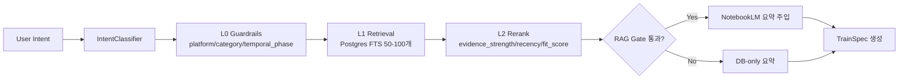
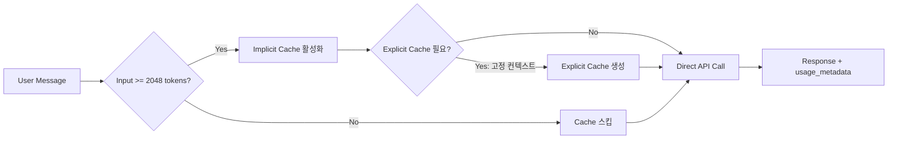

# Agent Chat + Train Recommendation Spec (Gemini 3 Flash)

**Version:** v2.0  
**Updated:** 2026-01-04

---

## 1. Goals

- 하단 고정형 에이전트 채팅으로 사용자 의도(바이럴 변주 아이디어, 상황, 아이템, 캠페인 목표) 즉시 수집
- DB + NotebookLM RAG 기반으로 숏폼 예시 및 Parent/Kids 변주 트랙 추천
- 노드/그래프 UI 노출 없이 "열차 + 3옵션 연결고리" 메타포로 변주 선택 제공
- **Gemini 3 Flash + Context Caching**(실시간) / **Batch API**(백그라운드) 듀얼 전략으로 비용 최적화

---

## 2. Constraints / Non-Goals

| 항목 | 원칙 |
|------|------|
| 노드/그래프 UI | 메인 사용자 플로우에 절대 노출하지 않음 (내부 오케스트레이션만) |
| NotebookLM 원문 | DB-wrapped 원칙 유지, 원문 직접 출력 금지 |
| RAG 인프라 | 대규모 다중 벡터DB 금지, 경량 FTS + 리랭크로 구성 |
| 모바일 UI | 하단 Dock이 BottomNav/SafeArea와 충돌하지 않도록 설계 |

---

## 3. UX: Center-Bottom Accordion + Hub-Spokes

### 3.1 기본 상태 (Collapsed)

```
┌──────────────────────────────────────┐
│                                      │
│         (메인 콘텐츠)                 │
│         /for-you, /remix 등          │
│                                      │
│                                      │
│                                      │
│                                      │
├──────────────────────────────────────┤
│    [──────🤖 에이전트──────]          │  ← 중앙 하단 Accordion Bar
└──────────────────────────────────────┘
       (탭하면 위로 확장)
```

### 3.2 확장 상태 (Expanded)

```
┌──────────────────────────────────────┐
│         (메인 콘텐츠 - 어둡게)        │
├──────────────────────────────────────┤
│  ╭────────────────────────────────╮  │
│  │ [▼ 접기]     💬 에이전트        │  │  ← 접기 버튼
│  │                                │  │
│  │ 💬 무엇을 찾고 계세요?          │  │  ← Chat Thread
│  │ ─────────────────────────────  │  │
│  │                                │  │
│  │  ┌────────────────────────┐   │  │
│  │  │ 🎬 [Parent: 몸통 영상]  │   │  │  ← Hub (중심)
│  │  │  "28만뷰 훅 패턴..."    │   │  │
│  │  └────────────────────────┘   │  │
│  │                                │  │
│  │  ┌──────┐ ┌──────┐ ┌──────┐   │  │
│  │  │변주A │ │변주B │ │변주C │   │  │  ← Spokes (3 옵션)
│  │  │ 훅   │ │오디오│ │비주얼│   │  │
│  │  └──────┘ └──────┘ └──────┘   │  │
│  │                                │  │
│  │  ┌────────────────────────┐   │  │
│  │  │ 🎁 관련 체험단 (선택)   │   │  │  ← Optional Campaign
│  │  └────────────────────────┘   │  │
│  │                                │  │
│  │ [________________] [전송]      │  │  ← Input
│  ╰────────────────────────────────╯  │
└──────────────────────────────────────┘
```

### 3.3 동작 흐름

| 상태 | 트리거 | 결과 |
|------|--------|------|
| Collapsed → Expanded | Accordion Bar 탭 | Bottom Sheet 올라옴, 배경 어둡게 |
| Expanded → Collapsed | 접기 버튼 or 배경 탭 or 스와이프 다운 | 원래 상태 복귀 |
| Chat → Recommend | 에이전트 "이대로 찾으시겠습니까?" + 수락 | **Morph Transition 시작** |

### 3.4 Morph Transition: Masonry → Hub-Spokes ✨

> [!TIP]
> 에이전트가 충분한 상황 파악 후 추천 확정 시, 메인 Masonry 그리드에서 카드들이 Hub-Spokes 배치로 **애니메이션 전환**됩니다.

#### 3.4.1 전환 시퀀스

```
[ Step 1: 에이전트 확정 ]
┌──────────────────────────────────────┐
│  💬 코미: "이대로 찾으시겠습니까?"     │
│                                      │
│  [✓ 수락]  [✗ 다시 설명]              │
└──────────────────────────────────────┘
           ↓ 수락 클릭

[ Step 2: Masonry Highlight ]
┌──────────────────────────────────────┐
│  ┌───┐ ░░░ ┌───┐                     │
│  │ A │     │ B │  ← 추천 카드 하이라이트
│  └───┘ ░░░ └───┘                     │
│  ░░░ ┌───┐ ░░░ ┌───┐                 │
│      │ C │     │ D │  ← 나머지 fade  │
│  ░░░ └───┘ ░░░ └───┘                 │
│  (배경 어둡게)                        │
└──────────────────────────────────────┘
           ↓ 250ms

[ Step 3: Fly-in Animation ]
┌──────────────────────────────────────┐
│                 ╭───╮                │
│  A ──fly──►     │ A │  ← Hub 위치    │
│                 ╰───╯                │
│                                      │
│  B,C,D ──stagger fly──►              │
│          ┌───┐ ┌───┐ ┌───┐          │
│          │ B │ │ C │ │ D │ ← Spokes │
│          └───┘ └───┘ └───┘          │
└──────────────────────────────────────┘
           ↓ 150ms × 3

[ Step 4: Hub-Spokes 완성 ]
┌──────────────────────────────────────┐
│  ╭────────────────────────────────╮  │
│  │  🎬 [Hub: Parent 카드]          │  │
│  │  ┌──────┐ ┌──────┐ ┌──────┐   │  │
│  │  │Spoke1│ │Spoke2│ │Spoke3│   │  │
│  │  └──────┘ └──────┘ └──────┘   │  │
│  │  🎁 체험단 (fade-in)            │  │
│  │  [________________] [전송]      │  │
│  ╰────────────────────────────────╯  │
└──────────────────────────────────────┘
```

#### 3.4.2 애니메이션 타이밍

| 단계 | 요소 | 지속시간 | Easing |
|------|------|----------|--------|
| 1 | 배경 dim overlay | 100ms | ease-out |
| 2 | Hub 카드 fly-in | 250ms | spring (stiffness: 300) |
| 3 | Spokes stagger fly-in | 150ms × 3 (stagger 50ms) | spring |
| 4 | 체험단 fade-in | 200ms | ease-in |
| 5 | 입력창 slide-up | 150ms | ease-out |

#### 3.4.3 기술 스택

| 방식 | 라이브러리 | 용도 |
|------|------------|------|
| **Shared Element** | Framer Motion `layoutId` | 카드 위치 morph |
| **Spring Physics** | React Spring / Framer Motion | 자연스러운 움직임 |
| **Native (옵션)** | View Transition API | Chrome 111+ 네이티브 지원 |

```tsx
// Framer Motion 예시
<motion.div
  layoutId={`card-${cardId}`}  // Masonry와 Hub에서 동일 ID
  transition={{ type: "spring", stiffness: 300, damping: 30 }}
>
  <HubCard data={parentCard} />
</motion.div>
```

### 3.5 컴포넌트 구조

```
AgentAccordion (전체 컨테이너)
├── AccordionBar (collapsed 상태 바)
└── AgentSheet (expanded 상태)
    ├── SheetHeader (접기 버튼 + 타이틀)
    ├── ChatThread (메시지 스레드)
    ├── ConfirmPrompt ("이대로 찾으시겠습니까?")
    ├── HubCard (Parent 카드, layoutId 공유)
    ├── SpokeOptions (변주 3개, stagger animation)
    ├── CampaignLink (체험단, fade-in)
    └── InputBar (입력창 + 전송)
```

### 3.6 BottomNav 공존

- Accordion Bar는 BottomNav **위**에 위치
- 확장 시 BottomNav는 숨김 or 어둡게 처리
- Safe Area 여백 확보

---

## 4. Data Sources (Existing)

| 데이터 | 테이블/필드 |
|--------|-------------|
| Parent/Kids | `remix_nodes`, `genealogy_depth`, `parent_node_id` |
| Evidence | `evidence_snapshots` (`confidence`, `sample_count`) |
| NotebookLM 요약 | `notebook_library.summary` |
| Outlier 예시 | `outlier_items` + `best_comments` |
| O2O 캠페인 | `o2o_campaigns`, `o2o_locations` |

---

## 5. RAG + Recommendation Flow



---

## 6. NotebookLM RAG Reliability Gate ⚠️

> [!IMPORTANT]
> 데이터가 아직 sparse하거나 신뢰도가 낮은 경우 NotebookLM RAG를 스킵하고 가벼운 DB-only 검색으로 폴백합니다.

### Gate 조건 (tunable defaults)

```python
def should_skip_notebooklm_rag(evidence: EvidenceSnapshot, cluster_entries: int, comments_count: int) -> bool:
    return (
        evidence.confidence < 0.6 or
        evidence.sample_count < 10 or
        cluster_entries < 3 or
        comments_count < 5
    )
```

### Gate 통과 실패 시 동작

1. **프롬프트에 NotebookLM 요약 주입하지 않음**
2. **DB 기반 요약만 사용** (outlier title, 짧은 메타데이터, evidence counts)
3. **UI 힌트 표시**: "📊 데이터 수집 중입니다 — 더 많은 증거가 쌓이면 정확도가 높아집니다"
4. **Train 플로우는 유지**, 주장 강도만 약화 (hard claim 회피)

---

## 7. HubSpec Response Schema

```typescript
type HubSpec = {
  session_id: string;
  query: string;
  hub: {
    id: string;
    type: "parent";
    title: string;
    hook?: string;
    summary?: string;
    evidence?: { comments?: string[]; lift?: string };
    source: { kind: "remix_node" | "notebook" | "outlier"; id: string };
  };
  spokes: Array<{
    id: string;
    type: "variation";
    label: string;
    rationale: string;
    mutation_type: "hook" | "audio" | "visual" | "semantic";
    preview?: { title?: string; thumbnail?: string };
    source: { kind: "remix_node" | "notebook" | "outlier"; id: string };
  }>;
  campaign?: {
    id: string;
    title: string;
    brand: string;
    reward?: string;
    deadline?: string;
  };
  rag_gate?: {
    passed: boolean;
    reason?: string;  // e.g. "low_confidence", "sparse_data"
  };
};
```

---

## 8. API Additions

| Method | Endpoint | Description |
|--------|----------|-------------|
| `POST` | `/api/v1/agent/recommend` | 쿼리 → HubSpec 생성 |
| `POST` | `/api/v1/agent/recommend/select` | Spoke 선택 → 다음 추천 |
| `GET` | `/api/v1/agent/recommend/{session_id}` | 세션 복원 |

응답에 `model_route`, `latency_ms` 포함하여 비용/성능 추적.

---

## 9. LLM Strategy: Gemini 3 Flash + Cost Optimization

> [!IMPORTANT]
> 실시간 채팅은 **Direct API + Context Caching**, 백그라운드 분석은 **Batch API**로 분리하여 비용 최적화.

### 9.1 Model Selection: Gemini 3 Flash

| 속성 | 값 |
|------|-----|
| Model | `gemini-3.0-flash-preview` |
| Input Cost | $0.50 / 1M tokens |
| Output Cost | $3.00 / 1M tokens |
| Context Window | 1M tokens |
| Launch Date | 2025-12-17 |

**근거**: Gemini 3 Flash는 "frontier intelligence built for speed"로 Gemini 3 Pro 수준 추론 + Flash 라인의 저지연/비용효율 결합

---

### 9.2 실시간 채팅 경로: Direct API + Context Caching



#### Implicit Caching (자동)

| 항목 | 값 | 근거 |
|------|-----|------|
| 활성화 | 기본 ON | 별도 설정 없이 자동 적용 |
| 최소 토큰 | **2,048 tokens** | 이하에서는 캐시 이점 없음 |
| 할인율 | **90%** (cached tokens) | 캐시 히트 시 input 비용 90% 절감 |
| Storage 비용 | 없음 | implicit은 별도 저장 비용 없음 |

**적용 전략**:
- 시스템 프롬프트 + 공통 컨텍스트를 **항상 prefix에 배치**
- 사용자 입력/세션 정보는 **뒤쪽에 배치**하여 prefix 유사성 극대화

#### Explicit Caching (수동)

| 항목 | 값 | 근거 |
|------|-----|------|
| 최소 토큰 | **4,096 tokens** | 이하에서는 캐시 생성 불가 |
| TTL 기본값 | **1시간** | 미지정 시 1h, 커스텀 가능 |
| Storage 비용 | **별도 과금** | TTL 기간 동안 저장 비용 발생 |
| 비용 절감 | **보장됨** | implicit과 달리 확정적 절감 |

**적용 대상**:
```python
EXPLICIT_CACHE_CANDIDATES = [
    "system_prompt_core",          # 변하지 않는 시스템 지침
    "terminology_conversion",       # 용어 변환 규칙
    "common_guidelines",           # 공통 가이드라인
    "pattern_snapshot",            # 패턴 스냅샷 (버전별)
]
```

**캐시 키 설계**:
```python
cache_key = f"{version}:{locale}:{hash(pattern_snapshot)}"
```

#### 토큰 임계값 게이트

```python
def should_use_explicit_cache(input_tokens: int, context_tokens: int) -> bool:
    """
    Gemini 3 Flash Preview: 4096 토큰 미만에서 explicit 캐시 이점 없음.
    Storage 비용 회피를 위해 게이팅.
    """
    total = input_tokens + context_tokens
    return total >= 4096
```

#### 운영 측정

```python
# usage_metadata에서 cache hit 추적
response = model.generate_content(prompt)
cached_tokens = response.usage_metadata.get("cached_tokens", 0)
total_input = response.usage_metadata.get("prompt_token_count", 0)
cache_hit_ratio = cached_tokens / total_input if total_input > 0 else 0

# 주간 튜닝: cache_hit_ratio vs storage_cost 최적화
```

---

### 9.3 백그라운드 작업 경로: Batch API

> [!NOTE]
> Batch API는 24시간 SLO이므로 실시간 채팅에 부적합. 비동기 분석 전용.

| 항목 | 값 | 근거 |
|------|-----|------|
| 할인율 | **50%** | input/output 모두 50% 할인 |
| SLO | **24시간 내 완료** | 24h 초과 시 자동 취소 |
| 과금 | 처리된 요청만 | 취소 시 미처리 요청은 과금 없음 |

**적용 대상**:
- 주간/야간 Evidence 요약 대량 생성
- NotebookLM 결과 정제/리프레시
- 대량 리랭크/재계산
- 클러스터 메타데이터 갱신

---

### 9.4 비용 최적화 판단 트리

```
실시간 채팅만 있는가?
├─ Yes → Direct API + Caching (implicit 우선, explicit 선택적)
└─ No: 비동기 분석도 섞여 있는가?
    ├─ Yes → Caching(실시간) + Batch API(백그라운드)
    └─ No → Direct API only
```

---

### 9.5 Web Evidence (Pricing & Caching Docs)

| 출처 | 주요 내용 |
|------|----------|
| [ai.google.dev/gemini-api/docs/caching](https://ai.google.dev/gemini-api/docs/caching) | Implicit/Explicit 캐싱 상세 스펙 |
| [ai.google.dev/gemini-api/docs/pricing](https://ai.google.dev/gemini-api/docs/pricing) | Token pricing, storage 비용 |
| [ai.google.dev/gemini-api/docs/batch-api](https://ai.google.dev/gemini-api/docs/batch-api) | Batch 24h SLO, 50% 할인 |
| [developers.googleblog.com/.../batch-mode-gemini-api](https://developers.googleblog.com/en/scale-your-ai-workloads-batch-mode-gemini-api/) | Batch mode 공식 발표 |
| [blog.google (Gemini 3 launch)](https://blog.google) | Gemini 3 Flash Preview 출시 (2025-12-17) |

---

## 10. Implementation Notes

### Backend

- `genai_client.py` 기존 유지, Context Caching 로직 추가
- `agent.py`에 캐시 키 관리 + `usage_metadata` 로깅 연동
- `agent_recommend_service.py` 신규: 검색/리랭크/HubSpec 생성 책임 분리
- Batch API 클라이언트: `batch_genai_client.py` 신규 (야간 분석용)
- 세션 저장: Redis 또는 `recommend_sessions` DB 테이블

### Frontend

- `AgentAccordion` 컴포넌트 신규 → `AppShell.tsx` 하단 삽입
- `AccordionBar` (collapsed), `AgentSheet` (expanded) 상태 분리
- `HubCard`, `SpokeOptions`, `CampaignLink` 컴포넌트 분리
- `/login` 등 `NO_SIDEBAR` 페이지에는 Accordion 비노출
- BottomNav 위에 배치, 확장 시 BottomNav 숨김/어둡게 처리

---

## 11. Rollout Plan

| Phase | Scope | Criteria |
|-------|-------|----------|
| 1 | Accordion Bar + 기본 채팅 (추천 없음) | UI 안정성 확인 |
| 2 | Hub-Spokes 추천 + 변주 선택 | 사용자 피드백 수집 |
| 3 | 품질 루프 (선택 로깅 + evidence 연동) | 추천 정확도 개선 |

### QA Checklist

- [ ] `/`, `/for-you`, `/remix/[nodeId]`에서 Dock 겹침 확인
- [ ] RAG Gate 로직 단위 테스트 (pytest)
- [ ] 내부 사용자 5-10명으로 "변주 선택 UX" 검증

---

## 12. Related Docs

- [07_CANVAS_NODE_CONTRACTS.md](./07_CANVAS_NODE_CONTRACTS.md) — 노드 노출 원칙
- [09_UI_UX_STRATEGY.md](./09_UI_UX_STRATEGY.md) — UI 전략
- [NOTEBOOKLM_SPEC.md](./NOTEBOOKLM_SPEC.md) — NotebookLM 운영 원칙
- [06_PIPELINE_PLAYBOOK.md](./06_PIPELINE_PLAYBOOK.md) — 파이프라인 플레이북
- [14_PDR.md](./14_PDR.md) — RAG 인프라 제약

---

## 13. Web Evidence

### LLM & Cost Optimization
| 출처 | 내용 |
|------|------|
| [ai.google.dev/gemini-api/docs/caching](https://ai.google.dev/gemini-api/docs/caching) | Context Caching 스펙 |
| [ai.google.dev/gemini-api/docs/batch-api](https://ai.google.dev/gemini-api/docs/batch-api) | Batch API 24h SLO |
| [developers.googleblog.com](https://developers.googleblog.com/en/scale-your-ai-workloads-batch-mode-gemini-api/) | Batch 50% 할인 |

### UX & Animation Patterns
| 출처 | 내용 |
|------|------|
| [interaction-design.org](https://www.interaction-design.org) | Hub-and-Spoke 패턴 정의 |
| [uxpin.com](https://www.uxpin.com) | 모바일 내비게이션 패턴 |
| [uidesignz.com](https://uidesignz.com) | Shared Element Transition 트렌드 |
| [motion.dev (Framer Motion)](https://motion.dev) | layoutId 기반 morph animation |
| [parachutedesign.ca](https://parachutedesign.ca) | 애니메이션 타이밍 200-300ms 권장 |

---

## 14. MCP 2025 통합 전략

> [!IMPORTANT]
> 2025-12-09: Anthropic이 MCP를 **Agentic AI Foundation (AAIF)**에 기증.
> 공동 창립: Anthropic, OpenAI, Block | 지원: Google, Microsoft, AWS

### 14.1 기존 MCP 인프라 현황

이미 구현된 MCP 서버 (`backend/app/mcp/`):

| 영역 | 구현 상태 |
|------|----------|
| **Resources** | `komission://patterns`, `comments`, `evidence`, `vdg`, `director-pack` ✅ |
| **Tools** | `search_patterns`, `smart_pattern_analysis`, `generate_source_pack` ✅ |
| **Prompts** | `explain_recommendation`, `shooting_guide`, `risk_summary` ✅ |
| **Elicitation** | 20개 초과 선택 시 확인 요청 ✅ |
| **Structured Output** | Pydantic 모델 반환 ✅ |
| **FastMCP 2.14+** | Background Tasks + Progress ✅ |

### 14.2 2025-11 스펙 대응 현황

| 2025-11 기능 | 현재 상태 | 액션 |
|--------------|----------|------|
| OAuth 2.1 + CIMD | ❌ 미적용 | JWT로 충분, 엔터프라이즈 시 적용 |
| Tasks Primitive (async) | △ Background Tasks로 대체 | 장기 작업 시 마이그레이션 고려 |
| URL-mode Elicitation | ❌ 미적용 | 에이전트 확정 프롬프트에 적용 |
| Structured Tool Output | ✅ 적용됨 | HubSpec에 스키마 보장 추가 |

### 14.3 에이전트 채팅용 MCP 확장

**신규 Tool 추가:**

```python
@mcp.tool()
async def recommend_hub(
    query: str,
    filters: dict = None,
    ctx: Context = None
) -> HubSpec:
    """
    에이전트 채팅에서 Hub-Spokes 추천 생성.
    Structured Output으로 HubSpec 스키마 보장.
    """
    # 1. IntentClassifier + RAG Gate
    # 2. L1 Retrieval + L2 Rerank
    # 3. HubSpec 생성
    
    # Elicitation: 확정 프롬프트
    if ctx:
        response = await ctx.elicit(
            message="이대로 찾으시겠습니까?",
            response_type=bool
        )
        if not response.data:
            return None
    
    return hub_spec
```

### 14.4 MCP-UI (SEP-1865) 적용 계획

> [!NOTE]
> 2025-11 MCP Apps Extension으로 Hub-Spokes UI를 표준 위젯화

| 구성요소 | MCP-UI 연동 |
|----------|------------|
| HubCard | `@mcp-ui/hub-card` 위젯 |
| SpokeOptions | `@mcp-ui/option-group` 위젯 |
| ConfirmPrompt | URL-mode Elicitation |
| Morph Animation | 클라이언트 측 (ChatGPT, Claude) |

**지원 클라이언트:**
- ChatGPT (OpenAI Apps SDK `@mcp-ui/server` 어댑터)
- Claude Desktop (MCP 네이티브)
- Gemini (향후 지원 예상)

### 14.5 다른 파트 MCP 확장 기회

| 기존 기능 | MCP 확장 가능성 |
|----------|-----------------|
| **Audio Coaching** | ❌ 불필요 (Gemini Native Audio WebSocket) |
| **촬영 가이드** | ✅ `shooting_guide` 프롬프트 이미 있음 |
| **캠페인 연결** | ✅ `campaign://` 리소스 추가 가능 |
| **Evidence 조회** | ✅ 이미 `komission://evidence` 있음 |
| **VDG 재분석** | ✅ `reanalyze_vdg` 툴 이미 있음 |

### 14.6 기존 MCP 문서 업데이트 필요 항목

`MCP_CLAUDE_DESKTOP_SETUP.md` 업데이트 필요:

| 항목 | 현재 | 2025-12 기준 |
|------|------|--------------|
| AAIF 언급 | ❌ 없음 | ✅ 추가 필요 |
| MCP-UI/Apps | ❌ 없음 | ✅ SEP-1865 섹션 추가 |
| OAuth 2.1 CIMD | △ 언급만 | 구현 가이드 추가 |
| Tasks Primitive | ❌ 없음 | Background Tasks와 비교 섹션 |

