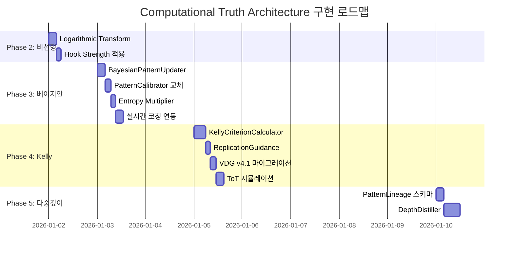

# 🚀 Computational Truth Architecture
## Komission VDG 고도화 마스터 로드맵

**작성**: 2026-01-01  
**목표**: 정적 패턴 분석 → 동적 베이지안 진실 엔진으로 진화

---

## Executive Summary

```
┌─────────────────────────────────────────────────────────────────────┐
│                    COMPUTATIONAL TRUTH ENGINE                        │
├─────────────────────────────────────────────────────────────────────┤
│                                                                      │
│  ┌──────────┐     ┌──────────┐     ┌──────────┐     ┌──────────┐   │
│  │  Phase 1 │────▶│  Phase 2 │────▶│  Phase 3 │────▶│  Phase 4 │   │
│  │ 제1원리  │     │ 변수매핑 │     │ 베이지안 │     │  Kelly   │   │
│  │  ✅ 95%  │     │  ⚠️ 70%  │     │  ⚠️ 50%  │     │  ❌ 10%  │   │
│  └──────────┘     └──────────┘     └──────────┘     └──────────┘   │
│         │                │                │                │        │
│         ▼                ▼                ▼                ▼        │
│   Invariant/       Exponential/      Dynamic           Optimal      │
│   Variable         Logarithmic       Updating          Betting      │
│   Separation       Transforms        Truth             Ratio        │
│                                                                      │
└─────────────────────────────────────────────────────────────────────┘
```

---

## 🏛 Phase 1: 제1원리 (Free Energy & Renormalization)

### 현재 상태: ✅ **95% 구현**

#### 1.1 구현 완료 항목

| 이론 | 구현체 | 파일 위치 |
|------|--------|-----------|
| **Entropy 최소화** | `hook_genome.pattern` | `vdg_v4.py:HookGenome` |
| **Scale Invariance** | `invariant_elements[]` | `vdg_v4.py:CapsuleBrief` |
| **Handicap Filter** | `evidence_comment_ranks` | `viral_kicks.evidence_*` |

#### 1.2 핵심 코드 매핑

```python
# 제1원리: Invariant (통제 변인) vs Variable (가변 요인) 분리
class CapsuleBrief(BaseModel):
    invariant_elements: List[str]   # 🔒 반드시 유지 (Scale-Invariant)
    variable_elements: List[str]    # 🔀 자기 색깔 허용
    do_not: List[str]               # 🚫 금지 행동 (Handicap Filter)
    product_slot: Optional[str]     # 📦 제품 삽입 타이밍
```

#### 1.3 Remaining 5%: 미세 개선

| 항목 | 현재 | 목표 | 우선순위 |
|------|------|------|----------|
| 다중 스케일 검증 | 개인→플랫폼 | 개인→플랫폼→글로벌 | P2 |
| Entropy 점수화 | 정성적 | $H(X) = -\sum p(x) \log p(x)$ | P1 |

---

## 🧮 Phase 2: 변수 아키텍처 (Non-linear Dynamics)

### 현재 상태: ⚠️ **70% 구현**

#### 2.1 구현 완료 ($E$, $H$, $S$)

```python
# $E$ (Exponential): 네트워크 효과
class ViralKick(BaseModel):
    mechanism: str           # "dopamine_spike", "pattern_break" 등
    evidence_comment_ranks: List[int]  # 바이럴 증폭 증거

# $H$ (Handicap Filter): Costly Signal 검증
class CommentEvidence(Base):
    like_count: int          # 비용 신호 (많은 좋아요 = 신뢰)
    matched_kick_ids: JSONB  # 킥과 연결된 증거

# $S$ (Sigmoid Gatekeeper): 임계점 필터
from quality_gate import proof_grade_gate
proof_ready, issues = proof_grade_gate.validate(vdg, duration_ms)
# proof_ready=False → 진입 금지 (0점 처리)
```

#### 2.2 미구현: $L$ (Logarithmic 체감)

**문제**: 현재 모든 점수가 선형 → 한계효용 체감 미반영

**해결안**:

```python
# 제안: 로그 스케일 변환 유틸리티
def apply_diminishing_returns(value: float, base: float = 10.0) -> float:
    """베버-페히너 법칙: 한계효용 체감"""
    if value <= 0:
        return 0.0
    return math.log(value + 1, base) / math.log(base + 1, base)

# 적용 예시
hook_strength_log = apply_diminishing_returns(raw_strength * 10)
view_count_log = apply_diminishing_returns(view_count / 1000)
```

#### 2.3 Phase 2 로드맵

| 단계 | 작업 | 소요 | 우선순위 |
|------|------|------|----------|
| 2.3.1 | `LogarithmicTransform` 유틸 추가 | 2h | P1 |
| 2.3.2 | `hook_genome.strength`에 로그 적용 | 1h | P1 |
| 2.3.3 | `viral_kicks.confidence`에 로그 적용 | 1h | P1 |
| 2.3.4 | 비선형 변환 레지스트리 생성 | 4h | P2 |

---

## 📊 Phase 3: 베이지안 동적 갱신 (Bayesian Updating)

### 현재 상태: ⚠️ **50% 구현**

#### 3.1 구현 완료: PatternCalibrator

```python
# 이미 구현됨! ✅ services/pattern_calibrator.py
class PatternCalibrator:
    """
    실제 성과 데이터를 기반으로 패턴 신뢰도를 보정하는 서비스
    
    작동 방식:
    1. 영상 분석 시 predicted_retention 기록
    2. 실제 업로드 후 actual_retention 수집
    3. 오차(error) 계산 → pattern_confidence 업데이트
    4. 다음 예측 시 confidence 가중치 적용
    """
    
    async def _update_pattern_confidence(self, ...):
        # 이동 평균으로 신뢰도 갱신
        new_confidence = max(0.0, min(1.0, 1.0 - new_avg_error))
```

#### 3.2 구현 완료: CoachingOutcome (RL 피드백)

```python
# 이미 구현됨! ✅ models.py + coaching_repository.py
class CoachingOutcome(Base):
    session_id: UUID              # 코칭 세션
    rule_id: str                  # 적용된 규칙
    t_sec: float                  # 타이밍
    compliance: bool              # 사용자 준수 여부
    metric_before: Optional[str]  # 이전 메트릭
    metric_after: Optional[str]   # 이후 메트릭
    feedback_type: str            # positive/negative/neutral
```

#### 3.3 구현 완료: Parent-Kids 계층 구조

```python
# 이미 구현됨! ✅ models.py
class RemixNode(Base):
    parent_node_id: Optional[UUID]  # 부모 노드 (Original)
    genealogy_depth: int            # 세대 깊이 (0=Parent, 1=Kid, 2=Grandkid)
    
    # 관계 매핑
    parent: relationship("RemixNode", back_populates="children")
    children: relationship("RemixNode", back_populates="parent")
```

#### 3.4 미구현: 진정한 베이지안 공식

**현재 한계**: 이동 평균 = **근사 베이지안** (정확한 수식 아님)

**목표 공식**:
$$P(Truth|Evidence) = \frac{P(Evidence|Truth) \times P(Truth)}{P(Evidence)}$$

**구현 로드맵**:

```python
# 제안: 정밀 베이지안 갱신기
class BayesianPatternUpdater:
    """
    베이지안 정리 기반 패턴 신뢰도 갱신
    """
    
    def update_posterior(
        self,
        prior: float,              # P(Truth) - 기존 신뢰도
        likelihood: float,         # P(Evidence|Truth) - 성공 시 관찰 확률
        evidence_prob: float,      # P(Evidence) - 전체 관찰 확률
    ) -> float:
        """정밀 베이지안 갱신"""
        posterior = (likelihood * prior) / evidence_prob
        return min(1.0, max(0.0, posterior))
    
    def batch_update(
        self,
        prior: float,
        outcomes: List[CoachingOutcome],
    ) -> float:
        """다중 증거 일괄 갱신"""
        current = prior
        for outcome in outcomes:
            # 성공 시 likelihood 높음, 실패 시 낮음
            likelihood = 0.9 if outcome.compliance else 0.2
            # Evidence probability는 전체 성공률에서 추정
            evidence_prob = self._estimate_evidence_prob(outcome.rule_id)
            current = self.update_posterior(current, likelihood, evidence_prob)
        return current
    
    def _estimate_evidence_prob(self, rule_id: str) -> float:
        """전체 데이터에서 증거 발생 확률 추정"""
        # DB에서 해당 rule_id의 전체 성공률 조회
        total_trials = self.get_total_trials(rule_id)
        successful_trials = self.get_successful_trials(rule_id)
        return (successful_trials + 1) / (total_trials + 2)  # Laplace smoothing
```

#### 3.5 미구현: Entropy Multiplier

**목표**: 예상 vs 실제 차이(Gap)의 정보량을 승수로 적용

```python
# 제안: Shannon Entropy 기반 가중치
def calculate_entropy_multiplier(
    predicted: float,
    actual: float,
) -> float:
    """
    예상과 실제의 차이가 클수록 정보 가치 높음
    
    섀넌 엔트로피: H(X) = -Σ p(x) log p(x)
    """
    gap = abs(actual - predicted)
    
    # Gap이 0이면 정보량 0 (뻔한 결과)
    if gap < 0.01:
        return 1.0  # 기본 승수
    
    # Gap이 클수록 높은 승수 (최대 2.0)
    # 로그 스케일로 폭발 방지
    entropy = -gap * math.log2(gap + 0.01)
    multiplier = 1.0 + min(1.0, entropy)
    
    return multiplier
```

#### 3.6 Phase 3 로드맵

| 단계 | 작업 | 소요 | 우선순위 | 의존성 |
|------|------|------|----------|--------|
| 3.6.1 | `BayesianPatternUpdater` 클래스 생성 | 4h | P0 | - |
| 3.6.2 | `PatternCalibrator`를 베이지안으로 교체 | 3h | P0 | 3.6.1 |
| 3.6.3 | `calculate_entropy_multiplier()` 유틸 | 2h | P1 | - |
| 3.6.4 | `viral_kicks.confidence`에 적용 | 2h | P1 | 3.6.2, 3.6.3 |
| 3.6.5 | 실시간 코칭 시 베이지안 갱신 연동 | 4h | P1 | 3.6.2 |
| 3.6.6 | NotebookLM Distill 결과 베이지안 주입 | 3h | P2 | 3.6.2 |

---

## ⚖️ Phase 4: Kelly Criterion (최적 자원 배분)

### 현재 상태: ❌ **10% 구현**

#### 4.1 이론적 배경

$$f^* = \frac{bp - q}{b}$$

| 변수 | 의미 | VDG 매핑 |
|------|------|----------|
| $f^*$ | 최적 자원 투입 비율 | `recommended_effort_percent` |
| $b$ | 성공 시 기대 수익 | `expected_viral_multiplier` |
| $p$ | 성공 확률 | `replication_success_rate` |
| $q$ | 실패 확률 ($1-p$) | - |

#### 4.2 현재 구현 (10%)

```python
# 부분 구현: CoachingSession에 compliance_target 존재
class CoachingSession(Base):
    target_pattern_id: str
    target_compliance_rate: float  # 목표 준수율 (p의 근사)
```

#### 4.3 완전 구현 설계

```python
# 제안: Kelly Criterion 계산기
class KellyCriterionCalculator:
    """
    최적 자원 배분 비율 계산기
    
    사용 시나리오:
    - 크리에이터: "이 패턴 따라할 때 얼마나 시간 투자해야 해?"
    - 브랜드: "이 O2O 캠페인에 예산 몇 % 배팅해야 해?"
    """
    
    def calculate_optimal_bet(
        self,
        success_probability: float,    # p: AI 시뮬레이션 결과
        expected_multiplier: float,    # b: 과거 데이터 기반 기대 수익
        current_confidence: float,     # 베이지안 신뢰도
    ) -> Dict[str, Any]:
        """켈리 공식 적용"""
        
        # 기본 켈리 계산
        p = success_probability
        q = 1 - p
        b = expected_multiplier
        
        kelly_fraction = (b * p - q) / b
        
        # 신뢰도 보정 (확신 낮으면 베팅 줄임)
        adjusted_fraction = kelly_fraction * current_confidence
        
        # 최종 권고
        if adjusted_fraction < 0:
            signal = "NO_GO"
            reason = "기대값 음수: 진입 금지"
        elif adjusted_fraction < 0.1:
            signal = "CAUTION"
            reason = "낮은 기대값: 최소 투자만"
        elif adjusted_fraction < 0.3:
            signal = "MODERATE"
            reason = "적정 기대값: 중간 투자"
        else:
            signal = "GO"
            reason = "높은 기대값: 적극 투자"
        
        return {
            "kelly_fraction": round(max(0, kelly_fraction), 4),
            "adjusted_fraction": round(max(0, adjusted_fraction), 4),
            "recommended_effort_percent": round(max(0, adjusted_fraction) * 100, 1),
            "signal": signal,
            "reason": reason,
            "inputs": {
                "success_probability": p,
                "expected_multiplier": b,
                "confidence": current_confidence,
            }
        }
    
    def simulate_scenarios(
        self,
        pattern_id: str,
        db: AsyncSession,
    ) -> Dict[str, Any]:
        """Tree of Thoughts: 3가지 시나리오 시뮬레이션"""
        
        # 과거 데이터에서 통계 추출
        stats = await self._get_pattern_stats(pattern_id, db)
        
        return {
            "best_case": self.calculate_optimal_bet(
                success_probability=stats["p_90th"],
                expected_multiplier=stats["multiplier_90th"],
                current_confidence=stats["confidence"],
            ),
            "normal_case": self.calculate_optimal_bet(
                success_probability=stats["p_median"],
                expected_multiplier=stats["multiplier_median"],
                current_confidence=stats["confidence"],
            ),
            "worst_case": self.calculate_optimal_bet(
                success_probability=stats["p_10th"],
                expected_multiplier=stats["multiplier_10th"],
                current_confidence=stats["confidence"],
            ),
        }
```

#### 4.4 VDG 스키마 확장

```python
# 제안: VDGv4.1에 추가
class ReplicationGuidance(BaseModel):
    """사용자를 위한 복제 가이드"""
    
    # 베이지안 신뢰도
    pattern_confidence: float = Field(ge=0.0, le=1.0)
    confidence_sample_count: int
    
    # 켈리 기준 결과
    success_probability: float = Field(ge=0.0, le=1.0)
    expected_viral_multiplier: float = Field(ge=0.0)
    kelly_fraction: float
    recommended_effort_percent: float = Field(ge=0.0, le=100.0)
    
    # 최종 신호
    go_nogo_signal: Literal["GO", "MODERATE", "CAUTION", "NO_GO"]
    signal_reason: str
    
    # 시나리오 시뮬레이션
    best_case_effort: float
    normal_case_effort: float
    worst_case_effort: float

class VDGv41(VDGv4):
    """VDG v4.1: Kelly Criterion 확장"""
    vdg_version: str = "4.1.0"
    replication_guidance: Optional[ReplicationGuidance] = None
```

#### 4.5 Phase 4 로드맵

| 단계 | 작업 | 소요 | 우선순위 | 의존성 |
|------|------|------|----------|--------|
| 4.5.1 | `KellyCriterionCalculator` 클래스 | 6h | P0 | Phase 3 완료 |
| 4.5.2 | `ReplicationGuidance` 스키마 | 2h | P0 | - |
| 4.5.3 | VDG v4.1 마이그레이션 | 3h | P0 | 4.5.2 |
| 4.5.4 | `simulate_scenarios()` ToT 구현 | 4h | P1 | 4.5.1 |
| 4.5.5 | 프론트엔드 Go/No-Go 표시 | 4h | P1 | 4.5.3 |
| 4.5.6 | 코칭 세션 시작 전 Kelly 검증 | 3h | P1 | 4.5.1 |

---

## 🔄 Phase 5: NotebookLM 다중 깊이 노드화 (Future)

### 목표: Parent-Kids 계층을 무한 깊이로 확장

#### 5.1 현재 구현

```
Parent (Depth 0)
└── Kid 1 (Depth 1)
└── Kid 2 (Depth 1)
└── Kid 3 (Depth 1)
```

#### 5.2 목표 구조

```
Parent (Depth 0)
├── Kid 1.1 (Depth 1)
│   ├── Grandkid 1.1.1 (Depth 2)
│   └── Grandkid 1.1.2 (Depth 2)
│       └── GreatGrandkid (Depth 3)
├── Kid 1.2 (Depth 1)
└── Kid 1.3 (Depth 1)
```

#### 5.3 설계 원칙

```python
# 제안: 계층적 패턴 진화 추적
class PatternLineage(BaseModel):
    """패턴 계보 추적"""
    
    # 현재 노드
    node_id: UUID
    depth: int
    
    # 조상 체인
    ancestor_chain: List[UUID]  # [parent, grandparent, great-grandparent, ...]
    
    # 진화 메타데이터
    mutation_from_parent: Dict[str, Any]  # 부모 대비 변화
    invariant_preserved: List[str]        # 유지된 불변요소
    variable_mutated: List[str]           # 변경된 가변요소
    
    # 성과 비교
    performance_delta: float              # 부모 대비 성능 변화
    survival_probability: float           # 다음 세대 생존 확률 (베이지안)

class DepthDistiller:
    """다중 깊이에서 패턴 정제"""
    
    async def distill_at_depth(
        self,
        cluster_id: str,
        max_depth: int,
        min_samples_per_depth: int = 3,
    ) -> Dict[str, Any]:
        """특정 깊이에서 공통 패턴 추출"""
        
        nodes = await self._get_nodes_at_depth(cluster_id, max_depth)
        
        # 각 깊이별 불변요소 교집합
        invariants_by_depth = {}
        for depth in range(max_depth + 1):
            depth_nodes = [n for n in nodes if n.depth == depth]
            if len(depth_nodes) >= min_samples_per_depth:
                invariants_by_depth[depth] = self._find_common_invariants(depth_nodes)
        
        # 깊이 간 불변요소 변화 추적
        invariant_decay = self._calculate_invariant_decay(invariants_by_depth)
        
        return {
            "invariants_by_depth": invariants_by_depth,
            "invariant_decay": invariant_decay,
            "strongest_invariants": self._find_strongest(invariant_decay),
            "recommended_max_depth": self._optimal_depth(invariant_decay),
        }
```

#### 5.4 Phase 5 로드맵

| 단계 | 작업 | 소요 | 우선순위 | 의존성 |
|------|------|------|----------|--------|
| 5.4.1 | `PatternLineage` 스키마 | 4h | P2 | Phase 4 |
| 5.4.2 | `DepthDistiller` 서비스 | 8h | P2 | 5.4.1 |
| 5.4.3 | NotebookLM API 연동 | 6h | P2 | 5.4.2 |
| 5.4.4 | 자동 깊이 확장 트리거 | 4h | P3 | 5.4.3 |
| 5.4.5 | 계보 시각화 UI | 6h | P3 | 5.4.4 |

---

## 📅 통합 마스터 타임라인



---

## 🎯 Critical Derivative (최소 노력, 최대 효과)

> **Phase 3.6.2**: `PatternCalibrator`를 정밀 베이지안으로 교체

**이유**:
1. 이미 구조가 존재 (리팩토링만 필요)
2. Phase 4 (Kelly)의 필수 전제조건
3. 모든 신뢰도 계산의 SSoT (Single Source of Truth)

---

## 📊 완료 시 예상 정합성

| Phase | 현재 | 목표 | 달성 시 효과 |
|-------|------|------|--------------|
| 1 | 95% | 100% | 제1원리 완전 정립 |
| 2 | 70% | 95% | 비선형 현실 반영 |
| 3 | 50% | 95% | 동적 진실 갱신 |
| 4 | 10% | 90% | 최적 의사결정 |
| 5 | 0% | 70% | 무한 깊이 진화 |

**Total**: 56% → **90%** (목표)

---

## 한 줄 요약

> **"데이터가 쌓일수록 스스로 정교해지는 베이지안 진실 엔진을 통해, 
> 사용자는 `invariant`만 지키고 `variable`에 자기 색깔을 입히면 
> 동일한 바이럴을 재현할 수 있다."**
